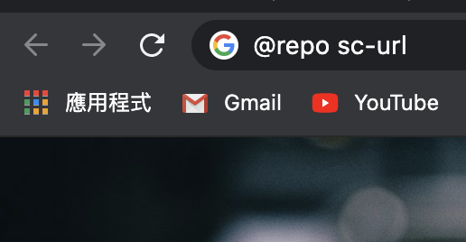
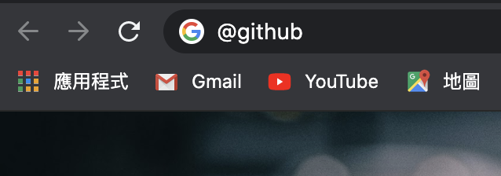

# sc-url

This is a chrome extension but not publish yet. If you want to use this extension, you can clone this repo and update the url in `js/event.js` for your own.

## Setting

```
# js/event.js

urls = {
    "music": "http://music.youtube.com/",
    "github": "https://github.com/VenseChang",
    "repo": "https://github.com/VenseChang/$1"
}
```

The structure is `"shortcut": "target url"` in Hash. If you need to give it parameters, you can use `$1`、`$2`、`$3` ... to specific it.

## Usage

- with params  


- without params  

